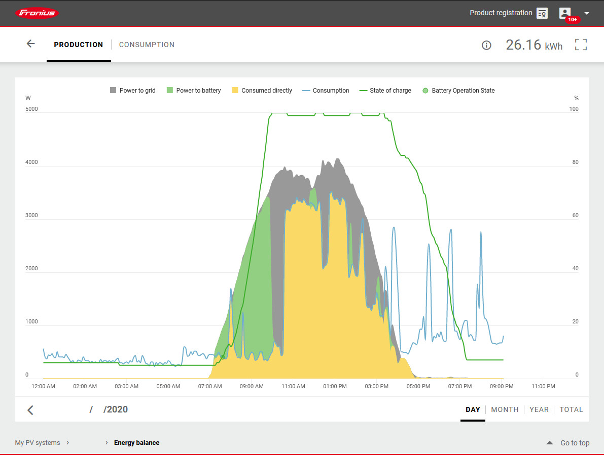
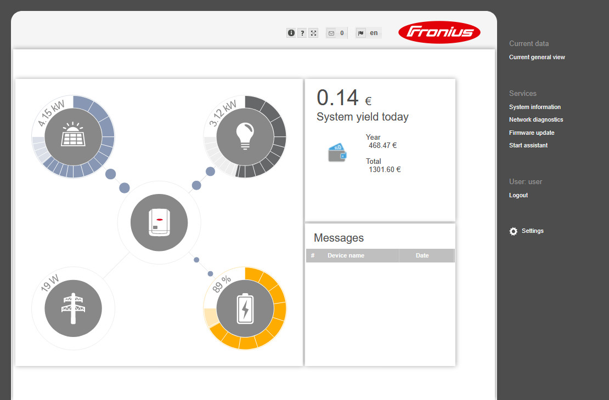
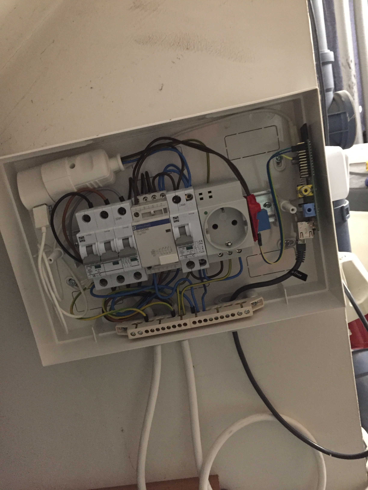
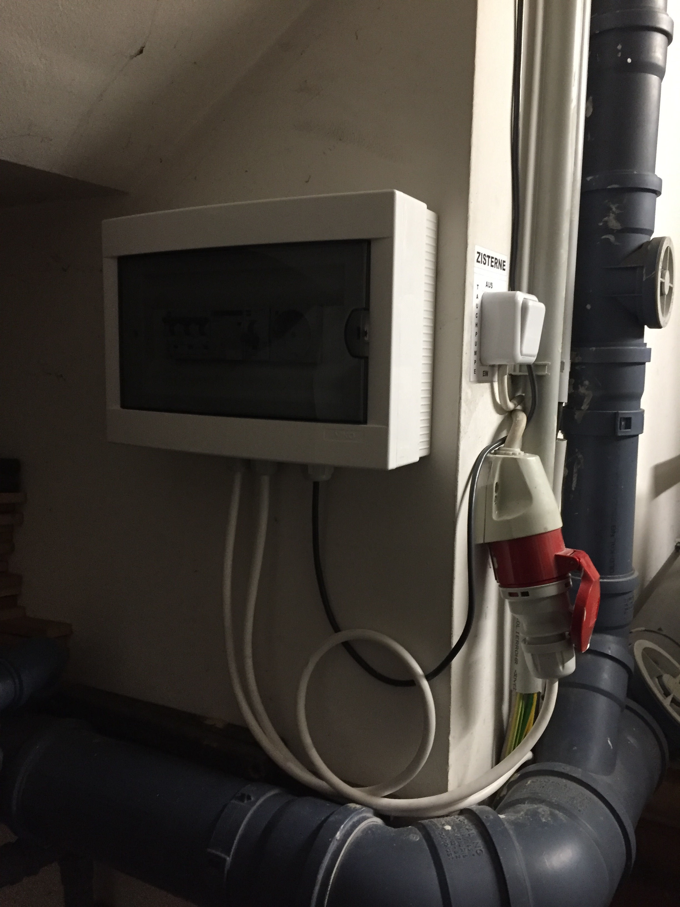

# Boilr

Water boiler automation with a Fronius pv inverter on a Raspberry Pi.

The objective was to harness the surplus generated by the PV system and enhance daytime self-consumption through water heating. This approach not only reduces the energy fed back to the grid but also curtails the need for heating resources like pellets, oil, or other fuels.


The yellow area illustrates the self-consumed energy after using Boilr (this program) to increase self-sufficiency. The blue line is the overall energy consumption. The gray region represents the surplus energy directed into the grid. The green line corresponds to the battery charge level, depicted as a percentage, while the green segment represents the surplus energy channeled into the battery.


Here, it's evident that all the energy generated by the PV system serves either to charge the battery or for direct consumption (inclusive of electrical devices and the water heater's heating element).

If dealing with the electrical aspect isn't within your comfort zone, it's advisable to seek assistance from an electrician, as mishandling it can pose serious risks.

## Additional Downloads

- Fronius official API documentation: [Documentation - Fronius Solar API V1](https://www.fronius.com/~/downloads/Solar%20Energy/Operating%20Instructions/42%2C0410%2C2012.pdf)
- Postman request collection: [Postman Collection - Fronius Solar API V1](https://www.getpostman.com/collections/27c663306206d7fbf502)

## Setup

### Containerised (recommended)

1. Build image (on Raspberry Pi)
   - `docker-compose build`
1. Run app in container
   - `docker-compose up -d`

#### Notes

In order to install and use Docker on a Raspberry Pi 1 Model B I had to set `sysctl vm.overcommit_memory=1` and restart after the installation.

### cli

1. Install python3
   - `sudo apt install python3 python3-venv`
1. Clone the repo
   - `git clone https://github.com/PeterBrain/boilr.git boilr`
   - `cd boilr`
1. Create a virtual environment (not not... it's up to you) & activate it
   - `python3 -m venv venv`
   - `source venv/bin/activate`
1. Install all requirements
   - `pip install -r requirements.txt`
1. Create boilr folder in /var/log
   - `mkdir /var/log/boilr`
1. Create boilr.log file in /var/log/boilr
   - `touch /var/log/boilr/boilr.log`
1. Edit configfile to your needs
   - `vi boilr/config.py`

## Usage

Starting:

```bash
python3 -m boilr start
```

Stopping:

```bash
python3 -m boilr stop
```

Others:

```bash
python3 -m boilr [-h] [-v] {start,stop,status,restart,run,manual {0,1}}
```

Complete guide (boilr -h):

```bash
usage: boilr [-h] [-v] {start,stop,status,restart,run,manual} ...

Water boiler automation with a Fronius pv inverter on a Raspberry Pi.

optional arguments:
  -h, --help            show this help message and exit
  -v, --verbose         log extra information

commands:
  {start,stop,status,restart,run,manual}
    start               Starts boilr daemon
    stop                Stops boilr daemon
    status              Show the status of boilr daemon
    restart             Restarts boilr daemon
    run                 Starts boilr in command-line
    manual              Manually override gpio channel (contactor)

Additional hardware required. Please check:
https://github.com/PeterBrain/boilr
```

<!-- for later
```bash
python3 setup.py
```
-->

## Requirements

### Software

- Raspberry Pi with operating system (for me it is model 1B with headless Raspbian)
- Python 3 (tested with 3.10)
- some python packages
- Docker

### Hardware

Here is a list of all parts I used (2020):

- Contactor to switch the three phases AC (~20€)
- 5x1.5mm2 copper stranded cable (~10€)
  - Ferrules (for stranded wires)
- circuit breaker (I had one available, but it would cost around 20€)
- Distribution box (~20€)
- Raspberry Pi 1B (used for about 5€) + an sd card for the os
- Relay for the pi (5pcs for 8€, only one necessary)
- Ethernet cable (I had an old one at home (Cat5 - not even Cat5e))
- Network switch (used, gigabit (overkill) around 5-10€, or an old router with a builtin switch for free)

I had the option to use a WiFi dongle instead of an Ethernet cable, but due to the weak signal strength in my cellar (where the water boiler is located), WiFi connectivity wasn't viable. Additionally, the PV inverter, which is already connected via LAN, is situated in the same area.

Inside | Outside
:-----:|:-------:
 | 

Regarding the second Schuko socket, I made an oversight and didn't consider the distribution box lid. Unfortunately, the lid cannot be closed when there's something plugged into the Schuko socket on the hut rail.

## Weaknesses

The existing design exhibits a significant limitation: in contrast to Ohmpilot, a comparable Fronius product that boasts notably higher efficiency due to its use of PWM (Pulse Width Modulation), my setup operates solely in two states. It's either fully activated, providing maximum power to the heating coil, or completely deactivated. The optimal efficiency advantage is sacrificed on days when PV production falls just short of meeting both the household's current consumption and the water heating requirements.

